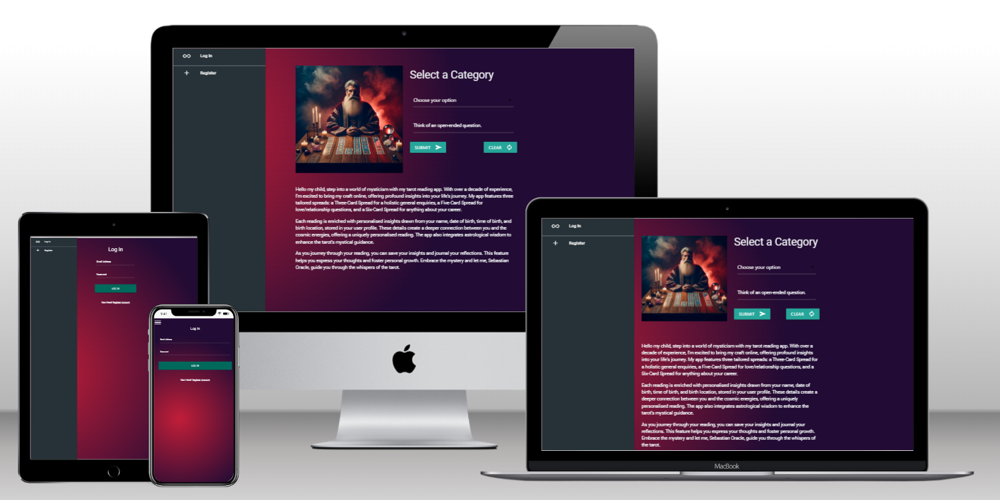
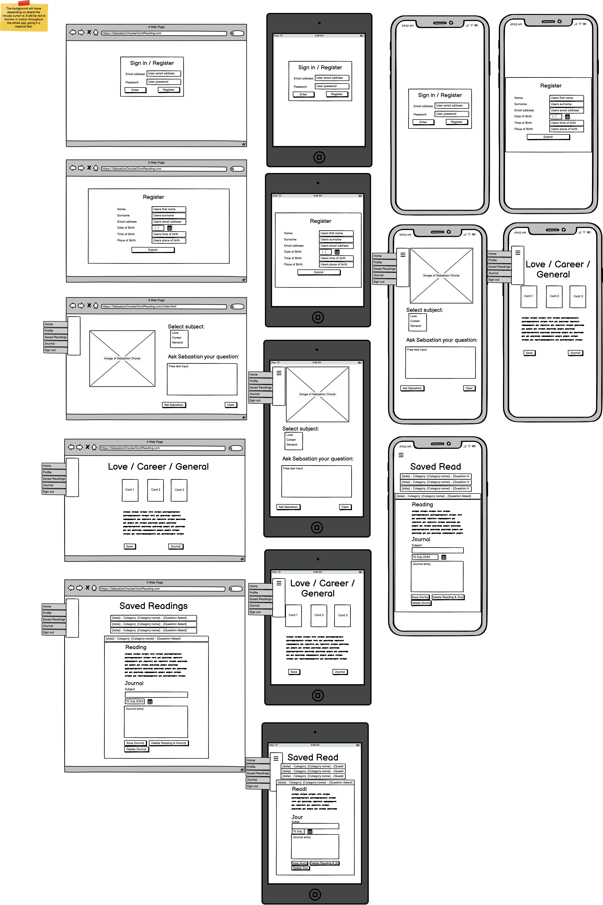
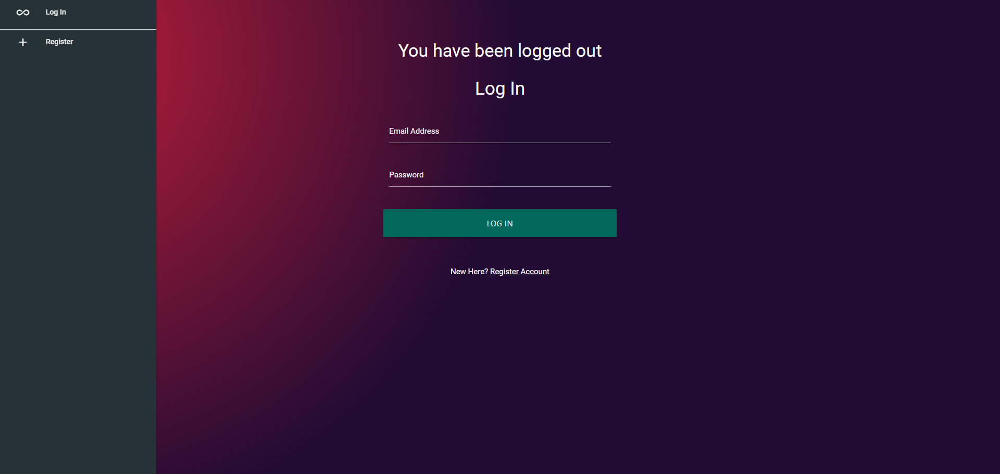
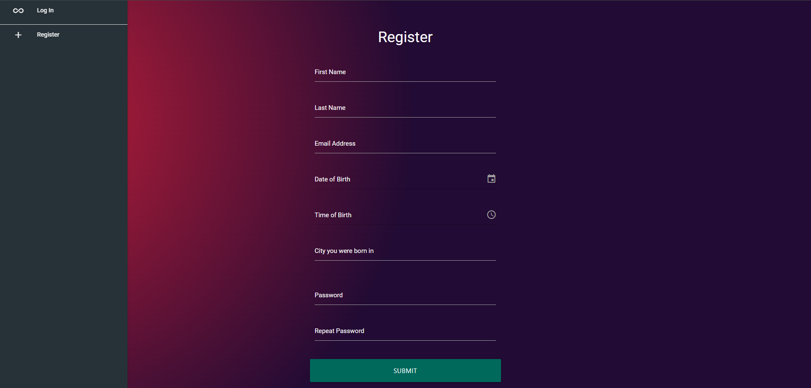
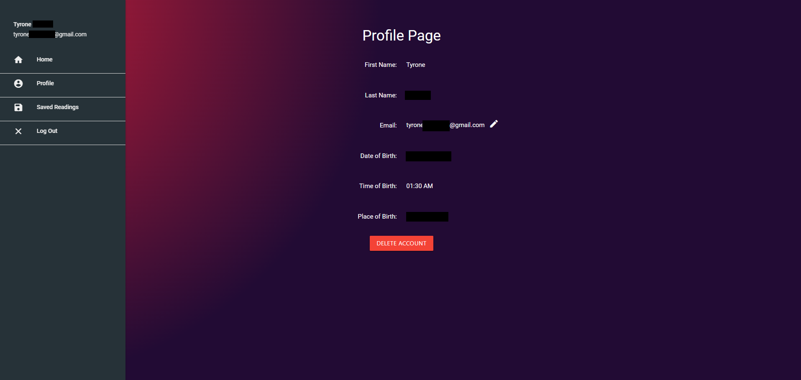
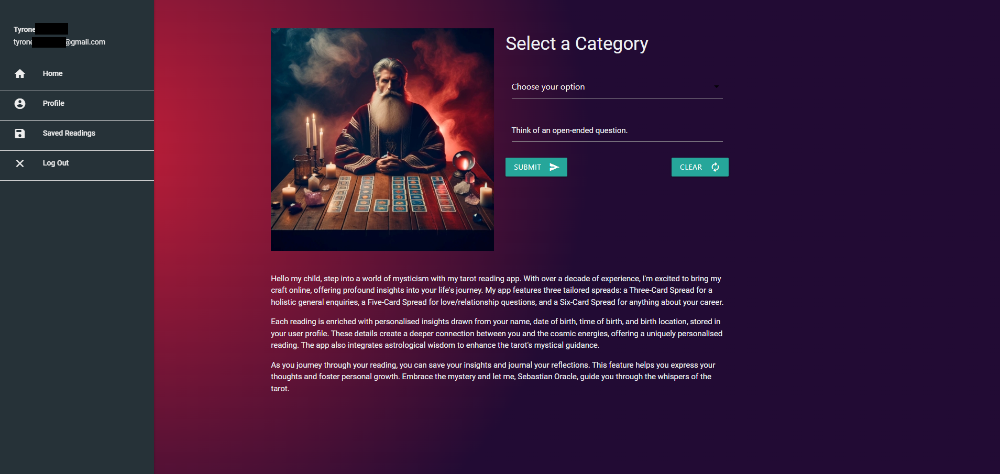
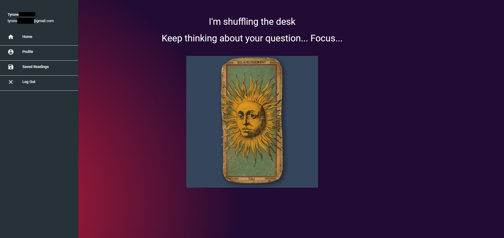
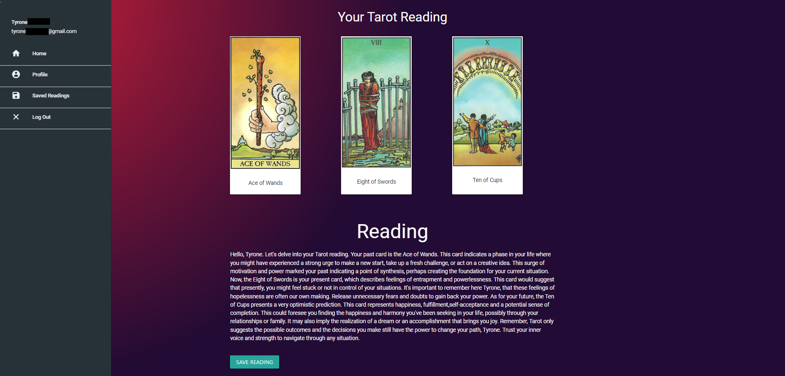
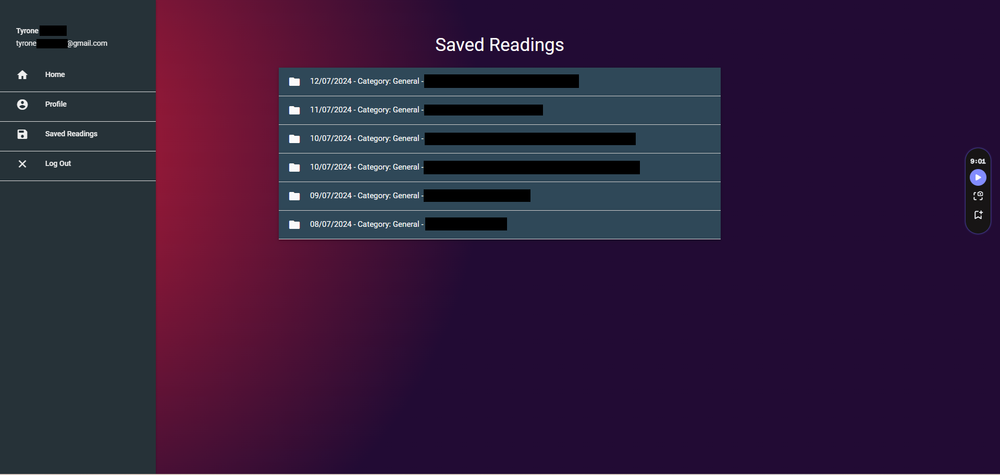
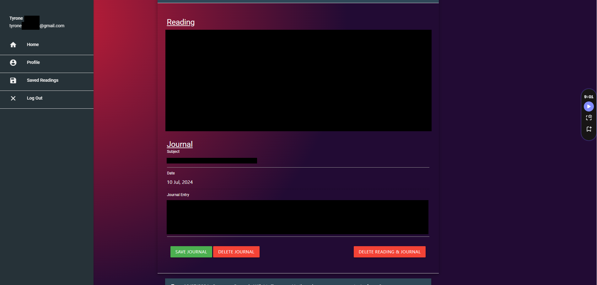

# Sebastian Oracle's - Milestone Project 3 

## HTML, CSS, JavaScript, Python+Flask and MongoDB - Back End Development

Enter a realm of mysticism and wonder with Sebastian Oracle's tarot reading app. With over a decade of experience, Sebastian Oracle now unveils his craft to the World Wide Web, offering you profound insights into your life's journey. The app features three distinctive spreads, each tailored to your specific enquiries:

General Life Enquiry (Three-Card Spread):
- **Reason:** Gain a holistic view of your life's many facets, understanding the interplay of various elements.
- **User Interaction:** Inquire, "What is the overall state of my life right now?" 
- **App functionality:** Three cards are drawn to capture your existence's essence.

Work/Career Enquiry (Five-Card Spread):
- **Reason:** Navigate the currents of your career, uncovering past influences, present challenges, and future prospects.
- **User Interaction:** Pose the question, "What can I expect in my career?" and draw 
- **App functionality:** Five cards drawn to illuminate your professional path.

Love Enquiry (Six-Card Spread):
- **Reason:** Delve into the tapestry of your romantic past, present, and future.
- **User Interaction:** Ask, "What should I know about my love life?" 
- **App functionality:** Six cards will be drawn to reveal the hidden truths of your heart.

Each reading is enriched with personalised insights drawn from the user's name, date of birth, time of birth, and birth location, which are stored in the user profile. These details weave a deeper connection between the querent and the cosmic energies at play, offering a reading that's uniquely theirs. The app integrates astrological wisdom, identifying life patterns and significant transitions, enhancing the tarot's mystical guidance.

As you journey through your reading, the app allows you to save your insights and journal your reflections. This feature helps you express your thoughts and feelings, fostering a deeper understanding and personal growth. Embrace the mystery, and let Sebastian Oracle guide you through the whispers of the tarot.

## Table of contents

1. [Business Needs](#business-needs)

2. [User Wants](#user-wants)

## Business Needs

### Business Needs:

1.	Market Differentiation:

-   Create a unique and engaging user experience that sets the app apart from other online tarot reading services.
-   Incorporate a blend of traditional tarot practices and modern technology to attract a broad audience.

2.	User Engagement:

-   Develop features that encourage regular use, such as daily tarot cards, personalized notifications, and seasonal promotions.
-   Create a community aspect with forums or social sharing options to increase user interaction and retention.

3.	Data Security and Privacy:

-   Ensure robust security measures to protect user data, particularly sensitive information like birth details.
-   Comply with data protection regulations to build user trust and maintain the app’s reputation.

### Future Development Business Wants:

1.	Revenue Generation:

-   Implement a pricing model that includes in-app purchases, subscription plans, or pay-per-reading options.
-   Offer premium features such as personalised readings, in-depth astrological insights, and detailed reports to increase revenue.

2.	Scalability:

-   Design the app to handle a growing user base without compromising performance.
-   Plan for future updates and expansions, including additional spreads, new astrological features, and enhanced user interface elements.

3.	Brand Development:

-   Promote Sebastian Oracle's brand through strategic marketing campaigns, including social media, influencer partnerships, and content marketing.
-   Foster a loyal user base through excellent customer support and regular engagement initiatives.

## User Wants:

1.	Accurate and Insightful Readings:

-   Provide tarot readings that users feel are accurate and insightful, offering real value and guidance.
-   Integrate astrological data to enhance the depth and personalisation of each reading.

2.	Ease of Use:

-   Design an intuitive and user-friendly interface that makes navigation and interaction straightforward and enjoyable.
-   Ensure the process of entering personal information and accessing readings is simple and hassle-free.

3.	Personalization:

-   Allow users to save their profiles with personal details to receive more tailored readings.
-   Offer options to store past readings and journal their thoughts for future reflection.

4.	Privacy and Security:

-   Guarantee that personal information, such as birth details and reading history, is kept confidential and secure.
-   Provide clear information on how user data is used and protected.

### Future Development User Wants:

1.	Engagement and Interactivity:

-   Include features that encourage users to engage with the app regularly, such as daily horoscopes or card pulls.
-   Offer interactive elements like the ability to share readings or participate in community discussions.
-   Pull their own cards and do their own readings. 

2.	Support and Guidance:

-   Provide access to resources that help users understand and interpret their readings better, such as guides or tutorials.
-   Ensure there is customer support available to assist with any questions or technical issues.
-   Links to other support such as mental health and crisis management.

3.	Flexibility:

-   Offer various reading options and spreads to cater to different questions and concerns users might have.
-   Allow users to choose the depth and detail of their readings, from quick insights to comprehensive analyses.

# Design

## Design Process for Sebastian Oracle

Sebastian Oracle was born out of my newfound passion for tarot cards. As someone who is new to tarot reading and doesn’t remember the meaning of every card, I started using ChatGPT to expedite my readings. This led to the idea of creating an app that automates this process, making tarot readings more accessible and efficient.

### Concept and Inspiration

The inspiration for Sebastian Oracle came from my personal journey with tarot cards. The name "Sebastian Oracle" reflects a mystical and ancient feel, aligning with the essence of tarot readings. 

### Colour Scheme and Aesthetic

To evoke a sense of mystery and magic, I chose a colour palette of darker reds and purples. These colours not only create a mystical ambiance but also make the app visually appealing and engaging for users. 

### Interactive Design Elements

While researching, I discovered a webpage with an intriguing feature: the colours changed and followed the mouse movement. Inspired by this, I inspected the page’s JavaScript code and experimented to incorporate a similar interactive element in my app. This feature enhances user engagement by providing a dynamic and immersive experience.

### Visual Assets

1. **Wizard Image**: The image of an old wizard-like man was generated using AI, adding a unique and mystical character to the app.
2. **Tarot Card Images**: All the tarot card images are original, as I scanned and saved each card individually for this project. This ensures the authenticity and uniqueness of the visual content in the app.

### Features and Functionality

1. **Automated Card Meanings**: Leveraging AI, the app provides instant interpretations of drawn tarot cards, helping users understand their readings without needing to reference external materials.
2. **User Interaction**: The interactive colour-changing background follows the user’s mouse movements, creating a visually stimulating environment.
3. **Personalized Readings**: Users can save their readings, including the date, questions asked, and detailed journal entries. This feature allows users to track their spiritual journey and reflect on past readings.

## Wire Frame

## Site Map

## Data Structure

### Users
| Field            | Type      |
|------------------|-----------|
| _id              | Object ID |
| first_name       | String    |
| last_name        | String    |
| email            | String    |
| date_of_birth    | Date      |
| time_of_birth    | String    |
| place_of_birth   | String    |
| password         | String    |

### tarotCards
| Field            | Type      |
|------------------|-----------|
| _id              | Object ID |
| cardName         | String    |
| cardImg          | String    |

### savedReadings
| Field            | Type      |
|------------------|-----------|
| _id              | Object ID |
| readingDate      | String    |
| questionAsked    | String    |
| readingData      | String    |
| journal_date     | Date      |
| journal_subject  | String    |
| journal_text     | String    |

## Technology used

### Languages
* [HTML5](https://developer.mozilla.org/en-US/docs/Web/Guide/HTML/HTML5) - build up layout and content of the application.
* [CSS3](https://developer.mozilla.org/en-US/docs/Web/CSS) - add custom styling and override Materialize stylings to fit with the theme of the app.
* [JavaScript](https://www.javascript.com/) - to add interactive functionailities to the app
* [Python](https://www.python.org/) - to build backend functionalities handling data, database interaction, and CRUD functionalities.

### Programs and Tools
* [MongoDB](https://www.mongodb.com/) - The database being used to store my tarot cards urls, users and readings
* [Amazon S3](shorturl.at/CULwv) - Cloud Object Storage - To store my tarot card images.
* [Image Resizer.com](https://imageresizer.com/) - To bulk resize my tarot card images.
* [ChatGPT](https://chatgpt.com/) - Generate an image of a tarot reader. 

### Frameworks and Libraries
* [Materialize](https://materializecss.com/) - A responsive front-end framework based on Material Design
* [Flask](https://flask.palletsprojects.com/en/3.0.x/) - a micro web framework for Python.
* [Flask-PyMongo](https://flask-pymongo.readthedocs.io/en/latest/) - a Flask extension for using MongoDB.
* [Werkzeug](https://werkzeug.palletsprojects.com/en/3.0.x/) - a comprehensive WSGI web application library used with Flask.
* [OpenAI](https://openai.com/) - for integrating OpenAI's API, using Chat GPT to guide me through some of the code and debut.
* [bson](https://bsonspec.org/#:~:text=BSON%20%2C%20short%20for%20Binary%20JSON,part%20of%20the%20JSON%20spec.) library for handling BSON data (related to MongoDB).
* [Python's](https://www.python.org/) standard libraries such as os, re, random, and datetime.

## Screenshots

### Login page

### Register page

### Profile page

### Home page

### Loading page

### Reading page

### Saved readings page 1

### Saved readings page 2

# Testing 
## Manaul Testing

### User Registration
1. **Can a user register with valid information?**
   - Yes, the user can register successfully with valid information.
2. **What happens if a user tries to register with an email that already exists?**
   - The system displays an error message indicating that the email is already in use.
3. **Is there a validation message for passwords that do not meet the required criteria?**
   - Yes, a validation message is displayed if the password does not meet the criteria.
4. **Does the system prevent registration if the passwords do not match?**
   - Yes, the system prevents registration and displays a message indicating the passwords do not match.
5. **Is a success message displayed upon successful registration?**
   - Yes, a success message is displayed upon successful registration.
6. **Is the user redirected to the home page after successful registration?**
   - Yes, the user is redirected to the home page after successful registration.

### User Login
1. **Can a user login with valid credentials?**
   - Yes, the user can login with valid credentials.
2. **What happens if a user tries to login with an incorrect email?**
   - An error message is displayed indicating that the email is incorrect.
3. **What happens if a user tries to login with an incorrect password?**
   - An error message is displayed indicating that the password is incorrect.
4. **Is there a validation message if either the email or password fields are empty?**
   - Yes, a validation message is displayed if either the email or password fields are empty.
5. **Is a success message displayed upon successful login?**
   - Yes, a success message is displayed upon successful login.
6. **Is the user redirected to the home page after successful login?**
   - Yes, the user is redirected to the home page after successful login.

### User Profile
1. **Can a logged-in user view their profile?**
   - Yes, a logged-in user can view their profile.
2. **Is the profile information displayed correctly?**
   - Yes, the profile information is displayed correctly.
3. **What happens if a non-logged-in user tries to access the profile page?**
   - The non-logged-in user is redirected to the login page.
4. **Can a user update their email address?**
   - Yes, a user can update their email address.
5. **What happens if a user tries to update their email to an already existing one?**
   - The system displays an error message indicating that the email is already in use.

### Tarot Reading Process
1. **Can a user select a tarot choice and ask a question?**
   - Yes, a user can select a tarot choice and ask a question.
2. **Is the tarot_choice and question correctly set in the session?**
   - Yes, the tarot_choice and question are correctly set in the session.
3. **Does the loading page process the tarot reading correctly?**
   - Yes, the loading page processes the tarot reading correctly.
4. **Is the tarot reading result displayed correctly on the reading page?**
   - Yes, the tarot reading result is displayed correctly on the reading page.
5. **What happens if there is no tarot_choice or question set in the session?**
   - The system displays an error message or prompts the user to select a tarot choice and ask a question.

### Saved Readings
1. **Can a logged-in user view their saved readings?**
   - Yes, a logged-in user can view their saved readings.
2. **Is the saved readings list displayed correctly with all details?**
   - Yes, the saved readings list is displayed correctly with all details.
3. **Can a user save a tarot reading?**
   - Yes, a user can save a tarot reading.
4. **Is there a success message displayed upon saving a reading?**
   - Yes, a success message is displayed upon saving a reading.
5. **Can a user delete a saved reading?**
   - Yes, a user can delete a saved reading.
6. **Is there a confirmation prompt before deleting a reading?**
   - Yes, there is a confirmation prompt before deleting a reading.
7. **Is there a success message displayed upon successful deletion?**
   - Yes, a success message is displayed upon successful deletion.

### Journal Entries
1. **Can a user add a journal entry to a saved reading?**
   - Yes, a user can add a journal entry to a saved reading.
2. **Is there a success message displayed upon saving a journal entry?**
   - Yes, a success message is displayed upon saving a journal entry.
3. **Can a user edit a journal entry?**
   - Yes, a user can edit a journal entry.
4. **Can a user delete a journal entry?**
   - Yes, a user can delete a journal entry.
5. **Is there a confirmation prompt before deleting a journal entry?**
   - Yes, there is a confirmation prompt before deleting a journal entry.
6. **Is there a success message displayed upon successful deletion of a journal entry?**
   - Yes, a success message is displayed upon successful deletion of a journal entry.

### Account Management
1. **Can a user delete their account?**
   - Yes, a user can delete their account.
2. **Is there a confirmation prompt before deleting the account?**
   - Yes, there is a confirmation prompt before deleting the account.
3. **Is there a success message displayed upon successful account deletion?**
   - Yes, a success message is displayed upon successful account deletion.
4. **Is the user redirected to the login page after account deletion?**
   - Yes, the user is redirected to the login page after account deletion.
5. **Are all saved readings and journal entries associated with the deleted account also deleted?**
   - Yes, all saved readings and journal entries associated with the deleted account are also deleted.

### Miscellaneous
1. **Does the date picker and time picker work correctly on the registration forms?**
   - Yes, the date picker and time picker work correctly.
2. **Are form fields cleared when the form is reset?**
   - Yes, form fields are cleared when the form is reset.
3. **Are validation messages correctly displayed and styled?**
   - Yes, validation messages are correctly displayed and styled.
4. **Are all user inputs sanitized to prevent XSS attacks?**
   - Yes, all user inputs are sanitized to prevent XSS attacks.
5. **Are all buttons and links functioning and redirecting correctly?**
   - Yes, all buttons and links are functioning and redirecting correctly.

## Light house and Validation teseting.

### Lighthouse

There are few lighthouse tests with a sore between 80 and 87. I thought the lower 80 for Mobile reading-page.html was due to larger imgages taking a while to load, but after resizing them, i'm still getting the same score. 

#### Mobile - login.html

#### Mobile - register.html

#### Mobile - index.html

#### Mobile - reading.html

#### Mobile - saved_reading.html

#### Mobile - profile.html

#### Desktop - login.html

#### Desktop - register.html

#### Desktop - index.html

#### Desktop - reading.html

#### Desktop - saved_reading.html

#### Desktop - profile.html

### Validation

I ran the website through [W3C Markup Validation Service](https://validator.w3.org/). No errors were found.

I ran the website through [W3C CSS Validation Service](https://jigsaw.w3.org/css-validator/). There was one warning from Materialize, but no errors from my own code.

I ran my Python code through [CI Python Linter](https://pep8ci.herokuapp.com/#). Initially, I had many lines that were too long. Some I managed to fix myself, but for others, I sought help from ChatGPT, as my line breaks were causing issues.

### Miscellaneous

I conducted extensive cross-browser testing, meticulously reviewing the website in various browsers. During this process, I systematically clicked on every button on each page to verify their functionality and ensure a consistent, error-free user experience across different platforms:

1. Google Chrome
2. Microsoft Edge
3. Opera
4. Mozilla Firefox
5. DuckDuckGo

I noticed a few styling issues on smaller screen resolutions, which I corrected. These were minor and primarily for visual appearance.

## Bugs and Issues

During this project, I felt I understood Python better than JavaScript. I encountered fewer bugs and issues because I followed the Non-Relational Database mini-project and adapted it to my needs. ChatGPT guided me on integrating its API into my project, which was very helpful.

### Connecting to MongoDB

I initially struggled to connect to MongoDB because I was using the wrong database name, mistakenly using the project name instead.

### Rendering Images

My images were not rendering because I hadn't configured the correct settings for Amazon S3. I lacked a Bucket Policy. With ChatGPT's help, I learned that I needed a policy and to ensure everything was made public. After doing this, everything worked.

### ChatGPT Version

When I installed ChatGPT, I got the latest version, but the code provided was for an older version. I noticed the error in the terminal and corrected it easily.

### Logged Out Message While Being Logged In

This bug was a tough one to sort out, but with ChatGPT's help, I figured it out. Here’s an overview:

#### Bug Overview

**Description:** The application was failing to process tarot readings correctly, consistently returning an "Invalid choice" error. This occurred because the server-side session was not correctly storing the `tarot_choice` and `question` values, leading to an inability to process the tarot reading request.

**Impact:** Users were unable to complete the tarot reading process, as the application could not recognize valid tarot choices and questions.

#### Cause of the Bug

**Root Cause:** The root cause was that the `tarot_choice` and `question` values were not being properly set and retrieved from the server-side session. The following specific issues were identified:

1. **Session Values Not Set Correctly:** The client-side code was storing the `tarot_choice` and `question` values in local storage but not properly updating the server-side session.
2. **Session Persistence Issues:** The session values were either missing or not being correctly maintained across different routes and requests.

#### Steps Taken to Address and Fix the Bug

1. **Add a Route to Set Session Data:** Created a new route to accept `tarot_choice` and `question` values from the client-side and set these values in the server-side session.
2. **Update Client-Side Code to Use the New Route:** Modified the client-side code to send the `tarot_choice` and `question` values to the new route before redirecting to the loading page.
3. **Verify Session Values in the Tarot Reading Processing Route:** Ensured that the route for processing tarot reading correctly retrieved the `tarot_choice` and `question` values from the session and handled the tarot reading logic accordingly.

**Summary:** The bug was caused by the server-side session not correctly storing and maintaining the `tarot_choice` and `question` values, leading to an inability to process tarot reading requests.

## Deployment to Heroku
1. Log in to [Heroku](https://www.heroku.com/)
2. On top right corner of the screen, locate the `New` button and the choose `Create new app`.
3. Give a unique name to the app, choose appropriate region, and click `Create`.
4. Access your app dashboard and click on `Deploy`.
5. Under `Deployment method`, choose GitHub and coonect to the respective repository.
6. Enable automatic deployment and click `Deploy`.
7. Set up environment on Heroku by going to `Settings` tab.
8. On `Config Vars` section, click `Reveal Config Vars`
9. Based on `env.py` file, add all the environment variables to the `Config Vars` section.
10. On top right coner of the app's dashboard, locate the button `Open app`. You will be able to see you deployed app with link to live site.